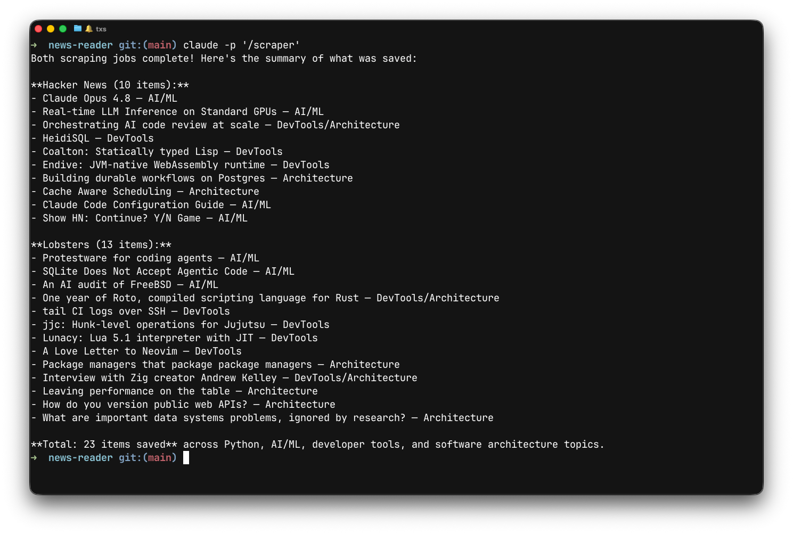
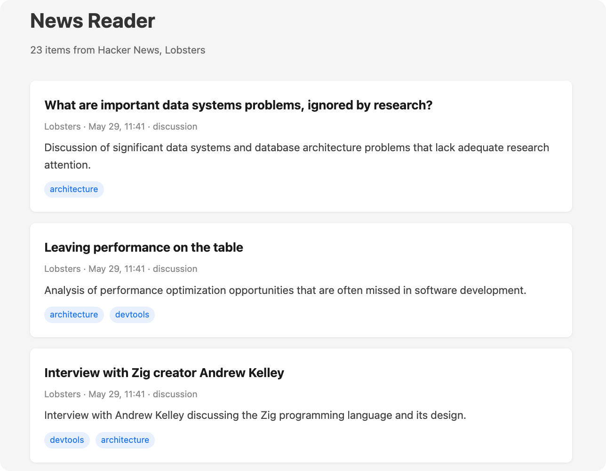

# News Reader

A companion repository for [Claude Code as Your Execution Environment](https://roman.pt/posts/claude-code-as-your-execution-environment/). It demonstrates the principles from that article: using Claude Code's agent loop as the execution environment, with deterministic code only where you need guarantees.

The project scrapes Hacker News and Lobsters for tech news, filters by topic, and shows the results on a local web page. The interesting part is how little traditional code there is. The agent drives the flow; Python only handles storage and display.

## Quickstart

Prerequisites: Python 3.12+, [uv](https://docs.astral.sh/uv/), Claude Code.

```bash
# In an interactive Claude Code session, type:
#   /scraper
#
# Or run non-interactively:
claude -p /scraper

# Browse results
uv run web.py             # http://localhost:5001
```



Running `/scraper` interactively uses your Claude subscription. Running `claude -p` uses a separate monthly token credit that comes with your plan ($20/month on Pro). See Anthropic's [billing details](https://support.claude.com/en/articles/15036540-use-the-claude-agent-sdk-with-your-claude-plan) for the full breakdown.

## Project structure

```
.
├── mcp_server.py                        # MCP server: save and list tools
├── web.py                               # Flask app: browse saved items
├── data/                                # JSON files, one per news item
├── .mcp.json                            # registers the MCP server
└── .claude/
    ├── settings.json                    # auto-approved tool permissions
    ├── agents/
    │   └── news-fetcher.md              # sub-agent definition
    └── skills/
        └── scraper/
            └── SKILL.md                 # entry point skill
```

## How the pieces connect

The architecture has three layers: a skill that orchestrates, sub-agents that fetch, and an MCP server that stores.

### Skill (the orchestrator)

`.claude/skills/scraper/SKILL.md` is the entry point. It's a markdown file with natural language instructions. When you run `/scraper`, Claude Code reads this file and executes it. The skill spawns two `news-fetcher` sub-agents in parallel, one per source site, and reports what they found.

The skill's `allowed-tools: Agent` declaration lets it spawn sub-agents without a permission prompt. It doesn't need access to WebFetch or the MCP tools because it delegates that work.

### Sub-agents (the workers)

`.claude/agents/news-fetcher.md` defines an isolated agent with a restricted tool set:

- `WebFetch` scoped to `news.ycombinator.com` and `lobste.rs`
- `mcp__news__save_news_item` for structured storage

The agent can't run Bash, read local files, or make arbitrary web requests. This matters because the agent processes content from the open internet. Even if a crafted page title contains a prompt injection, the agent can't do anything beyond fetching those two domains and saving news items.

The `model: haiku` frontmatter explicitly sets this agent to run on Haiku. In this project, the main session also runs on Haiku (set in `settings.json`), so the explicit override is mainly here for instructive purposes: it shows that you can control the model per sub-agent independently of the orchestrator.

### MCP server (the storage layer)

`mcp_server.py` is a [FastMCP](https://gofastmcp.com/) server that exposes two tools: `save_news_item` and `list_news_items`. The `save_news_item` tool takes a Pydantic model with field-level descriptions. FastMCP exposes these descriptions in the tool schema, so the agent knows what each field expects without extra prompting.

Each item is saved as a timestamped JSON file in `data/`. The MCP server validates input at the protocol level before the handler runs.

`.mcp.json` registers the server with Claude Code:

```json
{
  "mcpServers": {
    "news": {
      "command": "uv",
      "args": ["run", "mcp_server.py"]
    }
  }
}
```

### Permissions

`.claude/settings.json` sets the project model and auto-approves the tools that sub-agents need:

```json
{
  "model": "haiku",
  "permissions": {
    "allow": [
      "WebFetch(domain:news.ycombinator.com)",
      "WebFetch(domain:lobste.rs)",
      "mcp__news__save_news_item"
    ]
  }
}
```

The project uses Haiku for both the main session and sub-agents. Routine tasks like fetching pages, filtering headlines, and saving structured data don't need heavy reasoning. Start with Haiku; reach for a larger model only when results are wrong.

Without the `permissions.allow` entries, each tool call would prompt for approval. The skill's own `allowed-tools` and the sub-agent's `tools` restriction are separate concerns: the skill declaration controls what the skill can call, the agent definition restricts the sub-agent's sandbox, and `settings.json` controls which tools run without prompting.

### Web UI

`web.py` is a plain Flask app that reads JSON files from `data/` and renders them. It's independent of Claude Code and runs as a normal Python script.



## Data flow

```
/scraper skill
  ├── spawns news-fetcher (Hacker News)
  │     ├── WebFetch news.ycombinator.com
  │     └── save_news_item → data/20260529-141523-a3x9k2.json
  ├── spawns news-fetcher (Lobsters)
  │     ├── WebFetch lobste.rs
  │     └── save_news_item → data/20260529-141524-b7m2p4.json
  └── reports saved items

web.py reads data/*.json → renders HTML
```
